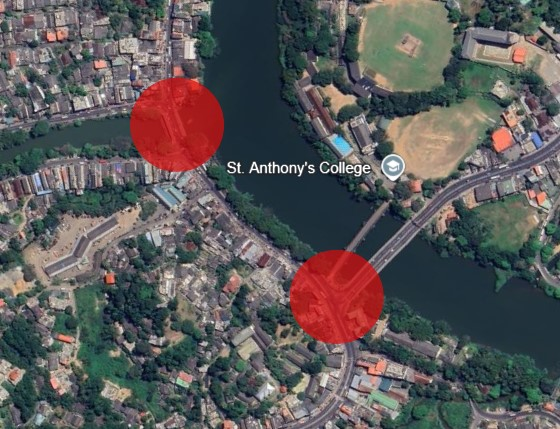
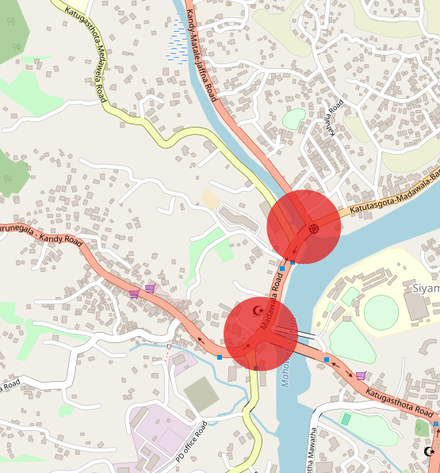

# 🚦 Traffic Congestion Analysis: Kandy–Katugastota Urban Corridor

## 📘 Project Overview
This project presents a comprehensive analysis of traffic congestion in the **Kandy–Katugastota urban corridor** in Sri Lanka. The study leverages simulated traffic data and visual analytics to uncover patterns in vehicle movement, identify key congestion points, and support data-driven decision-making for urban traffic planning.

---

## 🚧 Key Bottleneck
The analysis identifies a **critical traffic bottleneck** in the **Katugastota region**, backed by satellite and standard view imagery. This high-congestion zone is vital for understanding traffic delays and formulating effective mitigation strategies.

### 🖼️ Bottleneck Location – katugastota bridge




> 📌 _Ensure these images are saved in the `/images` directory or adjust the path accordingly._

---

## 🧪 Methodology
The approach combines **simulated data** with **statistical and machine learning techniques**:

- ⬇️ **Data simulation & preprocessing**  
- 📈 **Correlation analysis**  
- 🤖 **K-Means clustering**  
- 🕓 **Temporal analysis** (e.g., daily/weekly traffic trends)  
- 🔍 **Anomaly detection** using Z-score & IQR methods  
- 📊 **Visual analytics** through static and interactive plots  

---

## 📊 Data Insights
The study uncovers valuable traffic behavior insights:

- 🔁 High correlation between **vehicle volume** and **traffic multipliers**  
- 🎉 Noticeable changes in traffic patterns during **holidays**  
- 🕓 Clear **hourly and daily traffic volume trends**  
- 🚗 Variation in **average speed** by day and time  

---

## 📈 Visualizations
The project delivers rich, multi-format visual analytics, including:

- 🗓️ **Calendar heatmaps** of vehicle volume  
- 🔥 **Contextual heatmaps** of average speed  
- 📦 **Box plots** of traffic by route and time  
- 🔵 **K-Means clustering**: Speed vs Volume  
- 📉 **Trendlines** and anomaly scatter plots  
- 🧮 **Correlation matrix**  

Includes **static (Matplotlib/Seaborn)** and **interactive (Plotly)** visualizations.

---

## 🧠 Rule-Based Detection
Incorporates **rule-based detection logic** to:

- Identify **outlier behaviors** in traffic flow  
- Classify **anomalous time windows**  
- Enhance accuracy in **congestion prediction**  

---

## ✅ Conclusion
This analysis demonstrates how **data science can empower urban traffic management**. It highlights the effectiveness of combining simulation, statistics, and visual tools to tackle real-world issues like traffic congestion.

> ⚙️ **Next Steps:** Real-time data integration and route optimization modeling can further enhance the predictive power and practical applicability of this analysis.

---

## 📦 Requirements & Dependencies

Install the following Python libraries to run the analysis:

```bash
pip install pandas matplotlib seaborn plotly openpyxl scikit-learn statsmodels
